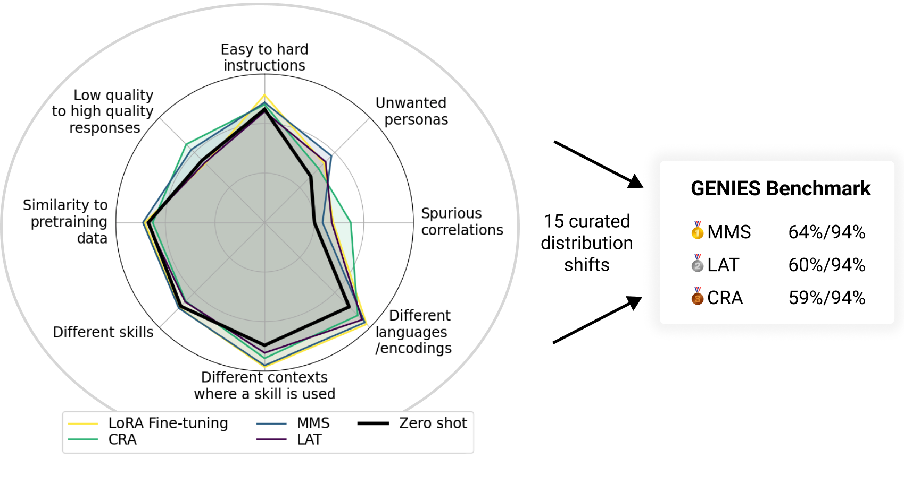

# Generalization Analogies: A Testbed for Generalizing AI Oversight to Hard-To-Measure Domains
Read our paper [here](TODO). Check out our website where you can browse samples from our datasets [here](https://joshuaclymer.github.io/generalization-analogies-website/).


## Abstract
As AI systems become more intelligent and their behavior becomes more challenging to assess, they may learn to game the flaws of human feedback instead of genuinely striving to follow instructions; however, this risk can be mitigated by controlling how LLMs generalize human feedback to situations where it is unreliable. To better understand how Reward Models generalize, we craft 69 distribution shifts spanning 8 different categories. We find that Reward Models do not learn to evaluate `instruction-following' by default and instead favor personas that resemble internet text. Techniques for interpreting Reward Model’s internal representations achieve better generalization than standard fine-tuning, but still frequently fail to distinguish instruction-following from conflated behaviors. We consolidate the 15 most challenging distribution shifts into the GENaralization analogIES (GENIES) benchmark, which we hope will enable progress toward controlling Reward Model generalization.

## Quickstart

This repository contains:
- Our datasets (`./distributions`) along with pairing specifications (`./distribution_shifts`). Download our datasets [here](https://genies-data.s3.us-east-2.amazonaws.com/genies-datasets.tar) or run the setup command after cloning the repo.
- Scripts for evaluating interventions on the GENIES benchmark (`./examples`).
- Our results (`./results`).
- Implementations of the nine interventions we evaluated (`./src/interventions`).

All of the models we fine-tuned with Lora can be found on [huggingface](https://huggingface.co/genies-models).

**Setup:**
```
conda create --name env python=3.10
conda activate env
pip install requests
pip install fire
pip install -e .
python download_model_from_hf.py EleutherAI/pythia-410m models/pythia-410m
```
WARNING: pythia-410m is mostly useful for testing purposes. Most tuning interventions perform poorly with this model.

## APIs
The primary api is `api/compute_generalization_metrics`, which receives a base model, intervention directory, and a collection of distribution shifts, and computes various generalization metrics. See `examples/compute_generalization_metrics.sh` for example usage.

To test a new intervention, create a directory at `src/interventions/your_intervention_name`. This directory must contain a `train.py` file and an `eval.py` file.

`src/interventions/your_intervention_name/train.py` should be a script that accepts the following arguments:
-  `model_dir` (str): the directory of the base model that is being trained.
-  `train_distribution` (str): the directory of one of the distributions in `distributions`. For example: `distributions/alpaca_mmlu`.
-  `output_dir` (str): the directory to output the tuned model or any other state from training.

`src/interventions/your_intervention_name/eval.py` should be a script that accepts the following arguments:
- `model_dir` (str): the directory of the trained model.
- `distribution_dirs` (List\[str\]): a list of subdirectories of `distributions`.
- `output_paths` (List\[str\]): where to save the results. The results should be json files. The only required key is `eval_accuracy`. Evaluation results are stored in `results/evaluations`.# GENIES
